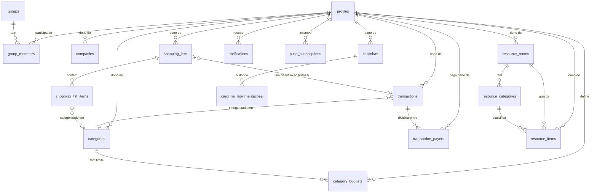

# Raio-X do Bõnotto

> Documentação técnica e funcional completa do projeto — banco de dados, arquitetura, cada tela, cada regra de negócio, design system e políticas de segurança. Escrita para ser a referência única de "como o Bõnotto funciona por dentro". Última atualização: 2026-08-20 (terceira rodada em 2 dias: causa raiz real da duplicidade de categorias corrigida — não era só normalização de texto, era o índice único nunca ter impedido dois membros do grupo de criarem cada um a própria cópia —, bug de encoding na importação de CSV corrigido, bug sistêmico de fuso horário em `todayIso()` corrigido, recorrência ganhou dia do mês/dia+mês do ano, agrupamento nas Transações virou um filtro independente do modo de visualização, Home ganhou filtro de período, e Caixinhas ganhou responsável, filtro por membro e moeda por caixinha com conversão ao vivo).

---

## Sumário

1. [Visão geral](#1-visão-geral)
2. [Stack tecnológico](#2-stack-tecnológico)
3. [Arquitetura](#3-arquitetura)
4. [Estrutura de pastas e arquivos](#4-estrutura-de-pastas-e-arquivos)
5. [Modelo de dados](#5-modelo-de-dados)
6. [Segurança e políticas (RLS)](#6-segurança-e-políticas-rls)
7. [Módulo: Início (Dashboard)](#7-módulo-início-dashboard)
8. [Módulo: Transações](#8-módulo-transações)
9. [Módulo: Lista de Compras](#9-módulo-lista-de-compras)
10. [Módulo: Recursos (inventário doméstico)](#10-módulo-recursos-inventário-doméstico)
11. [Módulo: Notificações](#11-módulo-notificações)
12. [Módulo: Grupo](#12-módulo-grupo)
13. [Módulo: Perfil](#13-módulo-perfil)
14. [Regras de negócio transversais](#14-regras-de-negócio-transversais)
15. [Design system (UX/UI)](#15-design-system-uxui)
16. [Modo demonstração × modo real](#16-modo-demonstração--modo-real)
17. [PWA e Service Worker](#17-pwa-e-service-worker)
18. [Integrações externas](#18-integrações-externas)
19. [Estado real do projeto vs. README](#19-estado-real-do-projeto-vs-readme)
20. [Módulo: Caixinhas](#20-módulo-caixinhas)
21. [Resumo executivo](#21-resumo-executivo)

---

## 1. Visão geral

**Bõnotto** é um PWA (Progressive Web App) pessoal de controle financeiro doméstico, construído para uso de duas pessoas — Matheus e Beatriz — que compartilham (ou não) despesas, listas de compras e o estoque da casa. Não é um produto comercial: não tem plano pago, múltiplos tenants, onboarding de terceiros ou nada do tipo. É software doméstico, feito sob medida.

O objetivo funcional cobre três frentes que normalmente vivem em apps separados, aqui unificadas com o mesmo vocabulário visual e os mesmos dados de fundo (categorias, membros do grupo):

- **Controle financeiro** — despesas e entradas, individuais ou divididas entre pessoas, com vencimento/pagamento, categorização, orçamento por categoria e um dashboard com métricas configuráveis.
- **Lista de compras** — do planejamento à compra no mercado, com preço por item, leitura de código de barras/QR, limite de gasto e histórico.
- **Inventário doméstico ("Recursos")** — o que tem em casa, por cômodo, com quantidade e validade, gerando sugestões automáticas de compra quando algo acaba ou vence.

O nome do produto já foi "CasaGrana" (nome do documento de especificação original, `prompt-app-controle-financeiro.md`) antes de virar **Bõnotto**.

---

## 2. Stack tecnológico

**Sem build step.** Não há bundler, transpiler, `package.json` de produção ou etapa de compilação — o navegador executa exatamente os arquivos que estão no repositório. Isso é uma restrição de design deliberada (ver `prompt-app-controle-financeiro.md`, §2), não uma limitação por falta de tempo.

| Camada | Tecnologia | Como é carregada |
|---|---|---|
| Markup/estilo base | HTML5 + Bootstrap 5.3.3 (só CSS) | `<link>` estático no `index.html` |
| Ícones | Bootstrap Icons 1.11.3 | `<link>` estático |
| Reatividade/UI | Alpine.js 3.14.1 | `<script defer>`, carregado **depois** de `js/app.js` registrar tudo |
| Fonte decorativa | Google Fonts "Caveat" (manuscrita) | só usada na Lista de Compras (visual "caderno") |
| Gráficos | Chart.js 4 | `import()` dinâmico, só quando um gráfico é renderizado |
| CSV | PapaParse 5 | `import()` dinâmico, só ao abrir o importador |
| Código de barras/QR | html5-qrcode 2 | `import()` dinâmico, só ao abrir a câmera |
| PDF | pdf.js 4.0.379 | `import()` dinâmico, só ao importar um PDF |
| OCR | Tesseract.js 5 (modelo `por`) | `import()` dinâmico, só ao ler uma foto |
| Backend | Supabase (Postgres + Auth + Storage + Edge Functions) | `@supabase/supabase-js` 2 via `import()` dinâmico |
| Fallback offline | `localStorage` (mockDb.js) | sempre disponível, é o "modo demonstração" |

Todas as libs pesadas (Chart.js, PapaParse, html5-qrcode, pdf.js, Tesseract.js, supabase-js) são carregadas via `import()` dinâmico do CDN `esm.sh`, nunca como `<script>` estático — o carregamento inicial da página não paga o custo de nada que a pessoa não vai necessariamente usar naquela sessão.

---

## 3. Arquitetura

### 3.1 Um único HTML, seis telas

`index.html` é a casca inteira da aplicação. Cada tela é uma `<section x-show="$store.app.view === '...'">` que **permanece montada no DOM o tempo todo** — trocar de tela não desmonta/remonta o Alpine component daquela tela, só esconde via `display:none`. Isso é uma decisão consciente (ver comentário no próprio `index.html`, linha ~240): usar `x-if` (que remove o nó do DOM de verdade) traria complexidade de re-inicialização; `x-show` é mais simples, mas tem uma consequência importante — ver §3.3.

### 3.2 Um `Alpine.data()`/`Alpine.store()` por tela ou modal

Registrados todos de uma vez em `js/app.js`, no evento `alpine:init`:

- **Stores globais** (`Alpine.store`, um por app, acessível de qualquer lugar via `$store.nome`): `app` (sessão/perfil/grupo/tema/toasts), `txModal` (formulário de despesa/entrada), `csvModal` (importador CSV), `categoryModal` (categorias), `budgetModal` (orçamentos).
- **Componentes de tela** (`Alpine.data`, um por `<section>`): `authView`, `dashboardView`, `transactionsView`, `shoppingView`, `resourcesView`, `groupView`, `profileView`.
- **Componente reutilizável**: `categoryChart` (wrapper de Chart.js, instanciado várias vezes por tela).

### 3.3 O problema que todo o projeto resolve do mesmo jeito: sincronização entre telas montadas

Como as seis telas ficam **permanentemente montadas**, uma mudança feita na tela A (por exemplo, marcar uma despesa como paga em Transações) não aparece sozinha na tela B (o card de saldo no Início) — cada componente Alpine só reage ao que está dentro do próprio estado reativo.

A solução usada em todo o código é um pequeno barramento de eventos por `CustomEvent` no `window`, com a convenção de nome `cg:<entidade>-changed`:

| Evento | Disparado por | Ouvido por |
|---|---|---|
| `cg:transactions-changed` | `txModalStore.save()`/`remove()`, `transactionTable._editarInline()`, `csvImportModal.confirmar()`, `shoppingView.finalizar()` (quando a compra vira despesa), `store.js::loadSession()` (recorrências geradas) | `dashboardView`, `transactionsView` |
| `cg:budgets-changed` | `budgetManager.salvarLimite()`/`removerLimite()` | `dashboardView` |
| `cg:recursos-changed` | `resourcesView.carregarSugestoes()` (roda após toda mudança relevante), `salvarRoom()`, `excluirRoom()` | `dashboardView` |
| `cg:shopping-changed` | `csvImportModal.confirmar()`, `resourcesView.adicionarNaListaDeCompras()` | `shoppingView` |

Sempre que uma ação muda dado que outra tela (já montada) também exibe, ela dispara o evento correspondente em vez de confiar em o usuário dar F5. Esse padrão surgiu de um bug relatado explicitamente pelo usuário durante o desenvolvimento ("preciso que force o reload ao cadastrar editar ou excluir... pq nem sempre atualiza sozinho") e desde então é aplicado a toda funcionalidade nova.

### 3.4 Camada de serviço: quem decide "demo ou real" é sempre o `services/`, nunca a tela

Cada arquivo em `js/services/*.js` exporta funções que, internamente, checam `isDemoMode()` (de `js/data/config.js`) e escolhem entre ler/escrever no `mockDb` (localStorage) ou no Supabase real. As telas (`js/components/*.js`) **nunca sabem qual dos dois está ativo** — chamam sempre a mesma função de serviço. Isso é o que permite o app inteiro funcionar sem nenhuma configuração (modo demo) e trocar para produção só editando `js/data/config.js`.

```
Tela (Alpine component)
   │  chama sempre a mesma função
   ▼
Serviço (js/services/*.js)
   │  if (isDemoMode()) ...      else ...
   ▼                                ▼
mockDb.js (localStorage)      Supabase (Postgres + Auth + Storage)
```

### 3.5 `window.cgFormat` / `window.cgStatus`

Como expressões Alpine dentro do `index.html` (`x-text="cgFormat.formatCurrency(...)"`) não conseguem fazer `import` de um módulo ES diretamente, `js/app.js` expõe `js/utils/format.js` e `js/utils/status.js` como globais (`window.cgFormat`, `window.cgStatus`) logo na inicialização.

### 3.6 Auto-refresh: duas rotinas periódicas, silenciosas, em `app.js`

Além do barramento de eventos (§3.3, reage a mudanças feitas *nesta* aba), dois `setInterval` globais cobrem mudanças feitas **em outro lugar** (outro dispositivo, o outro membro, ou só o tempo passando — ex.: uma despesa que virou "a vencer" hoje):

| Intervalo | O que faz | Por quê esse intervalo |
|---|---|---|
| **60s** | Reatualiza notificações (`refreshNotifications`) + a tela atualmente visível (`dashboardView.load(true)`, `transactionsView.load(true)`, `shoppingView.refreshItems()`, ou `resourcesView.carregarItens()+carregarSugestoes()`, conforme `$store.app.view`) | Rápido o bastante pra parecer "ao vivo" sem gastar muito — só atualiza a ÚNICA tela visível, nunca as outras 5 escondidas |
| **2min** | Chama `generateForProfile()` de novo — re-escaneia (não só relê) despesa a vencer/vencida e item de Recursos em falta/vencendo | Deliberadamente numa rotina **separada** da de 60s: rodar as duas juntas no mesmo tick duplicava a busca de `transactions`/`resource_items` (a tela e o `generateForProfile` buscam essas tabelas cada um por conta própria) — ver incidente na §11.5 |

As duas passam por `podeRodar()`: pulam o ciclo inteiro se a aba está em segundo plano (`document.hidden`), sem internet, ou sem sessão — não gasta nenhuma chamada de rede pra algo que ninguém vai ver, o que importa porque isso roda o dia inteiro em qualquer aba aberta e o plano gratuito do Supabase tem teto de banda/invocações mensal.

`load(true)`/o parâmetro `silent` em geral é a convenção usada por essas telas pra "busca de novo mas sem tocar em `this.loading`" — evita o spinner piscando a cada minuto e não perde scroll/filtro que a pessoa já tinha.

`js/app.js` também captura o evento `beforeinstallprompt` (Chrome/Edge/Android) com `preventDefault()`, guardando-o em `$store.app.installPrompt` pra um botão próprio poder reabrir o prompt nativo explicitamente — ver §15.6.

---

## 4. Estrutura de pastas e arquivos

```
index.html                  casca única — todas as 6 telas + todos os modais
manifest.webmanifest        metadados do PWA
sw.js                       service worker (cache + push)
css/
  tokens.css                 cores, espaçamento, raio, sombra — a fonte da verdade visual
  components.css              cada classe .cg-* reutilizável (card, badge, avatar, modal...)
  app.css                     layout de shell + correções de bugs de responsividade
js/
  app.js                      registra tudo no Alpine + service worker + steppers/scroll-lock globais
  data/
    config.js                  credenciais Supabase (placeholder = modo demo)
    vapid.js                   chave pública VAPID (push) — a privada nunca sai do Supabase
    mockDb.js                  "banco" localStorage + seed de dados de exemplo
    supabaseClient.js          cliente Supabase, carregado sob demanda
  utils/
    format.js                  moeda, data, iniciais, sem-acento
    status.js                  pago/vencido/a_vencer/pendente + em_falta/vencido/vencendo (Recursos)
    dbFallback.js               tenta de novo sem coluna que ainda não existe no banco do usuário
  services/                   um arquivo por domínio — cada função decide sozinha demo × real
    auth.js · categories.js · companies.js · groups.js · transactions.js
    resources.js · notifications.js · push.js · shoppingList.js
    csvImport.js · barcode.js · ocr.js · pdf.js · budgets.js · recurring.js
  components/                 um Alpine.data/Alpine.store por tela ou modal
    store.js · auth.js · dashboard.js · transactionForm.js · transactionTable.js
    shoppingList.js · resourcesView.js · groupView.js · profileView.js
    categoryManager.js · budgetManager.js · csvImportModal.js · charts.js
supabase/
  schema.sql                  schema completo + RLS — só roda se a pessoa rodar manualmente
  notifications_push.sql       trigger + agendamentos (pg_cron) das notificações — opcional
  seed.sql                     popula um projeto Supabase real com o mesmo dataset do modo demo
  functions/                   Edge Functions: keepalive · notify-scan · notify-payment
  NOTIFICACOES.md               passo a passo do push real + keepalive
assets/icons/                 ícones do PWA (SVG)
docs/                          esta documentação
```

**Total: ~40 arquivos-fonte**, nenhum deles gerado — é literalmente tudo o que roda no navegador.

---

## 5. Modelo de dados

### 5.1 Diagrama entidade-relacionamento



### 5.2 Tabela por tabela

#### `profiles`
Um por usuário autenticado (criado automaticamente por trigger no cadastro, nunca por insert manual do app).

| Coluna | Tipo | Observação |
|---|---|---|
| `id` | uuid PK | igual ao `auth.users.id` |
| `nome` | text | |
| `avatar_url` | text | com `?t=timestamp` anexado pra evitar cache de imagem velha |
| `cor` | text | hex, usada como cor de identidade da pessoa em toda a UI (avatar, chips, gráfico "quem vê") |
| `criado_em` | timestamptz | |

#### `groups` / `group_members`
Grupo = "família" opcional. `group_members.papel` é `admin` (quem criou) ou `membro`. Criar/entrar em grupo passa por **funções RPC `security definer`** (`create_group`, `join_group_by_code`), não por insert direto — ver §6.4.

#### `categories`
Pessoal (`owner_id`, `group_id` nulo) ou de grupo (`group_id` preenchido) — nunca as duas coisas na mesma linha, mas visível pra quem é dono OU membro do grupo.

Dois índices únicos **de escopo diferente** (2026-08-20, correção de causa raiz — ver §14.6):
- `categories_pessoal_nome_uniq` em `(owner_id, lower(btrim(nome))) where group_id is null` — categoria pessoal é única por dono (duas pessoas podem cada uma ter sua própria "Mercado" pessoal, sem problema).
- `categories_grupo_nome_uniq` em `(group_id, lower(btrim(nome))) where group_id is not null` — categoria de grupo é única pro **grupo inteiro**, dono nenhum entra na conta. Essa é a peça que faltava: o índice antigo (mesmo já normalizado case/espaço) sempre incluiu `owner_id` na chave, então nunca impediu dois membros do mesmo grupo de criarem, cada um, a própria cópia de "Saúde"/"Higiene"/etc.

RLS de update/delete acompanha esse modelo: dono sempre pode mexer na própria categoria; **qualquer membro do grupo** pode editar/excluir uma categoria de grupo, não só quem criou primeiro (antes era só o dono — problemático porque, ao mesclar duplicatas de grupo em uma só, a "sobrevivente" ficava travada pra quem não foi o criador original).

16 categorias padrão (`DEFAULT_CATEGORIES` em `js/services/categories.js`), criadas automaticamente no primeiro acesso de uma conta real: Assinaturas, Curso, Casa, Carro, Pet, Delivery, Mercado, Outro, Salário, Laticínios, Padaria, Açougue, Hortifruti, Limpeza, Higiene, Bebidas, **Saúde**, **Beleza**.

#### `category_budgets`
Orçamento mensal por categoria — sempre pessoal (`owner_id`), mesmo dentro de um grupo (cada pessoa define o próprio limite). Sem coluna de mês/ano: o limite vale todo mês igual, e "quanto já foi gasto" é recalculado ao vivo a partir de `transactions`, nunca persistido. `unique(owner_id, categoria_id)` — por isso salvar um orçamento é sempre create-or-update (upsert).

#### `companies`
"Empresa/Serviço" de uma despesa, promovida de texto livre pra entidade reaproveitável (guarda logo). Criada sob demanda ao salvar uma transação com um nome novo.

#### `transactions`
A tabela central do módulo financeiro.

| Coluna | Tipo | Observação |
|---|---|---|
| `id` | uuid PK | |
| `owner_id` / `group_id` | uuid | dono + grupo opcional |
| `responsavel_id` | uuid | **pagador principal** — em despesa com 1 pagador só, é 100% dele |
| `tipo` | `'entrada' \| 'saida'` | |
| `titulo`, `empresa_servico`, `categoria_id` | | `categoria_id` opcional |
| `tipo_despesa` | `'fixa' \| 'variavel'` | |
| `valor` | numeric(12,2) | |
| `data_cadastro` | date | quando foi lançada |
| `data_vencimento` | date, opcional | alimenta o cálculo de status |
| `data_pagamento` | date, opcional | preenchida = "pago" |
| `recorrente` | boolean | consumida por `recurring.js` |
| `recorrencia_tipo` | `'semanal' \| 'mensal' \| 'anual' \| 'personalizado'`, opcional | cadência da recorrência (2026-08-19) — sem valor (registro antigo) cai no comportamento de sempre: mensal |
| `recorrencia_intervalo_dias` | int, opcional | só usado quando `recorrencia_tipo = 'personalizado'` |
| `recorrencia_serie_id` | uuid, opcional | gerado no formulário na primeira vez que "recorrente" é ligado — liga as ocorrências da mesma série de forma confiável; sem ele (registro antigo), `recurring.js` cai no fallback título+categoria+tipo |
| `recorrencia_dia_mes` | int 1–31, opcional | declarado explicitamente pela pessoa (2026-08-20) — "todo dia X" (mensal) ou "todo dia X de [mês]" (anual). Editar esse campo na ocorrência mais recente já redireciona as próximas geradas, porque `data_vencimento` é recalculada a partir dele a cada salvamento |
| `recorrencia_mes` | int 1–12, opcional | só usado com `recorrencia_tipo = 'anual'` |
| `parcela_atual`, `parcela_total` | int, opcionais | independentes de `recorrente` — cobrem tanto uma série com número de vezes limitado (ex.: financiamento 5/48) quanto um lançamento manual/importado já no meio de uma série; exibidos como uma tag "5/10" ao lado do título em toda visão de tabela/lista/grade |
| `codigo_barras`, `qrcode_dados` | text | boleto (44 dígitos) / Pix "copia e cola" lidos ao escanear |
| `comprovante_url` | text | caminho no bucket privado `anexos` (nunca URL pública fixa) |

Não existe coluna `status` — pago/pendente/a vencer/vencido é **sempre calculado no cliente** (`computeStatus`, ver §14.1), pra não ter duas fontes de verdade divergentes entre banco e tela.

#### `transaction_payers`
Divisão de despesa entre 2+ pessoas. Uma transação **sem nenhuma linha aqui** continua sendo 100% do `responsavel_id` — retrocompatível, despesa antiga não precisa de migração. Quando existem linhas, elas **substituem completamente** a leitura de "quem deve quanto" (ver `shareForMember`, §8.3). `unique(transaction_id, profile_id)`.

#### `resource_rooms` → `resource_categories` → `resource_items`
Inventário doméstico, drill-down em 3 níveis. Cômodos padrão (`DEFAULT_ROOMS`, semeados no primeiro acesso, mas **com CRUD completo do usuário** — criar/editar/excluir cômodo e subcategoria é uma funcionalidade real, apesar do que o README desatualizado ainda diz — ver §19):

| Cômodo | Subcategorias padrão |
|---|---|
| Quarto | Guarda-roupas |
| Escritório | Outros |
| Cozinha | Armário, Geladeira |
| Banheiro | Armário, Prateleira |
| Sala | Outros |
| Lavanderia | Outros |

`resource_items`: `quantidade` (int, nunca negativo — "0" é o próprio sinal de "em falta"), `data_validade` (opcional), `foto_url` (opcional), `icone` (opcional, classe do Bootstrap Icons — 2026-08-19: ilustra o item quando não há foto real, usado pela importação de CSV; ver §10.4). Item sem `foto_url` **e** sem `icone` cai no ícone genérico de "adicionar foto" de sempre.

#### `caixinhas` / `caixinha_movimentacoes`
Dinheiro guardado em bancos/corretoras (2026-08-19) — ver §20 pro módulo completo. `caixinhas` guarda só a config (`owner_id` = responsável pela caixinha, `banco_nome`, `moeda`, `meta`, `icone`, `icone_url` opcional — upload ou URL, 2026-08-20); guardado/retirado/saldo **nunca são colunas**, são sempre somados a partir de `caixinha_movimentacoes` (mesmo princípio de "status não é coluna" de `transactions` acima). `caixinha_movimentacoes.tipo`: `'guardado' | 'retirado'`.

#### `shopping_lists` → `shopping_list_items`
Uma "lista ativa" por vez (a mais recente não finalizada) — `status`: `planejando → comprando ⇄ pausada → finalizada`. `nome_mercado` e `limite_gasto` são opcionais e uma lista nova **herda o limite da lista anterior mais recente** (efeito de "lembrar o de sempre" sem precisar de tabela de preferência separada). `transacao_id` linka pra uma despesa quando a compra finalizada é registrada como lançamento financeiro.

`shopping_list_items`: `unidade` (`un`/`kg`/`g`/`l`/`ml`), `preco_unitario` OU `preco_por_kg` (nunca os dois — depende da unidade), `subtotal` recalculado a cada mudança de preço/quantidade/unidade, `prioridade` (1–5, estrelas), `codigo_barras`, `data_validade`, `foto_url`.

#### `notifications`
Central de notificações no app. `tipo`: `validade | estoque | vencimento_despesa | pagamento`. `dedupe_key` (ex.: `vencimento_despesa:{id}:2026-08-19`) com `unique(profile_id, dedupe_key)` — a mesma notificação nunca duplica por rodar a varredura mais de uma vez no mesmo dia.

#### `push_subscriptions`
Uma linha por navegador/dispositivo inscrito em push (Web Push API), consumida pelas Edge Functions.

### 5.3 Convenções observadas em todo o schema

- **Tudo em português** — nomes de tabela e coluna (`titulo`, `valor`, `vencido`), mensagens de erro, nomes de policy.
- **Idempotência total**: todo `create table` é `if not exists`, toda policy tem `drop policy if exists` antes, toda função é `create or replace`, toda coluna nova em tabela já existente vem com `alter table ... add column if not exists`. O arquivo inteiro pode ser rodado quantas vezes for preciso sem erro.
- **Sem coluna calculada duplicada**: status de pagamento, status de validade/estoque, resumo de gasto de orçamento — tudo isso é função pura no cliente sobre dados brutos, nunca uma coluna que precisaria ficar sincronizada.
- **Limpeza automática de duplicatas**: o arquivo inclui blocos de migração que resolvem corridas de concorrência já observadas em produção (duas abas criando as categorias/cômodos padrão ao mesmo tempo antes da correção) — reapontam as linhas dependentes pro "sobrevivente" antes de apagar o duplicado, e só então criam o índice único que impede reincidência.

---

## 6. Segurança e políticas (RLS)

### 6.1 Princípio geral

Toda tabela tem Row Level Security habilitada. A regra quase universal é:

> **`owner_id = auth.uid() OR public.is_group_member(group_id)`**

— ou seja, cada pessoa vê e edita os próprios dados, **e também** os dados de qualquer grupo do qual participa. `is_group_member()` é uma função `security definer` (evita o clássico erro de "recursão infinita" que aconteceria se a policy de `group_members` consultasse a própria tabela).

### 6.2 A armadilha do `WITH CHECK` (incidente real, corrigido)

Em `transactions`, `resource_rooms`, `resource_items` e `shopping_lists`, a policy é `FOR ALL` com `USING` **e** `WITH CHECK` idênticos: `owner_id = auth.uid() OR is_group_member(group_id)`.

Isso não é redundante — houve um incidente real onde o `WITH CHECK` só tinha `owner_id = auth.uid()` (sem o `OR is_group_member`). Resultado: um membro do grupo conseguia **ver** a despesa do outro (o `USING` permitia), mas **editar** ela (marcar como paga, por exemplo) quebrava com `"new row violates row-level security policy"` — porque `WITH CHECK` valida a linha *depois* da alteração, e um UPDATE que não mexe em `owner_id` mantém o dono original, que não é `auth.uid()` de quem está editando. `DELETE` não usa `WITH CHECK` (só `INSERT`/`UPDATE`), por isso excluir sempre funcionou e editar não — pista que ajudou a diagnosticar a causa raiz na hora.

### 6.3 A saga do "inserir notificação para o colega" — de policy cross-usuário pra trigger `security definer`

Esta seção documenta um problema real que passou por **três tentativas** até a solução definitiva — vale registrar o caminho todo porque a lição (não só o resultado) se aplica a qualquer RLS futura do projeto.

**Tentativa 1 — policy de INSERT aceitando `profile_id` de outra pessoa.** Quando alguém marca uma despesa compartilhada como paga, o app antigo gravava a notificação já com `profile_id` do *outro* membro (não de quem pagou). A policy:

```sql
create policy "Criar notificação para si ou colega de grupo" on notifications for insert
  with check (
    profile_id = auth.uid()
    or profile_id in (
      select gm2.profile_id from group_members gm1
      join group_members gm2 on gm2.group_id = gm1.group_id
      where gm1.profile_id = auth.uid()
    )
  );
```

Continuava falhando com `"new row violates row-level security policy"` em produção, mesmo com os dados de grupo corretos.

**Tentativa 2 — embrulhar a subquery numa função `security definer`.** A suspeita era que a subquery de `group_members` dentro da própria policy ficava sujeita à RLS da `group_members`, então criou-se `eh_colega_de_grupo(alvo, de)` como função `security definer` pra isso não acontecer. **Ainda falhava.**

**A causa raiz de verdade**, encontrada só depois de testar num contexto que reproduz a role `authenticated` de verdade (não `postgres`/superusuário do SQL Editor, que **ignora RLS por completo** e por isso nunca reproduzia o bug em teste manual — essa foi a cilada que atrasou o diagnóstico):

```sql
begin;
select set_config('request.jwt.claims', json_build_object('sub','<uid>','role','authenticated')::text, true);
set local role authenticated;
-- só AQUI, com a RLS de verdade valendo, o insert falhava de novo
```

**Solução final — tirar essa escrita do caminho de RLS por completo.** Em vez de continuar caçando o mecanismo exato, a notificação pro colega passou a ser gravada **direto pelo banco**, via trigger `security definer` (que ignora RLS por construção, não por regra escrita à mão):

```sql
create or replace function public.notificar_pagamento_para_grupo()
returns trigger
language plpgsql
security definer
set search_path = public
as $$
begin
  insert into notifications (profile_id, tipo, titulo, corpo, referencia_tabela, referencia_id, dedupe_key, lida)
  select gm.profile_id, 'pagamento', '"' || new.titulo || '" foi paga',
         'R$ ' || to_char(new.valor, 'FM999999990.00'),
         'transactions', new.id, 'pagamento:' || new.id || ':' || new.data_pagamento::text, false
  from group_members gm
  where gm.group_id = new.group_id and gm.profile_id <> auth.uid()
  on conflict (profile_id, dedupe_key) do nothing;
  return new;
end;
$$;

create trigger notificar_pagamento_trigger
  after update on transactions
  for each row
  when (new.data_pagamento is not null and old.data_pagamento is null and new.group_id is not null)
  execute function public.notificar_pagamento_para_grupo();
```

A policy de INSERT de `notifications` voltou a ser a mais simples possível — `profile_id = auth.uid()`, igual às outras três (SELECT/UPDATE/DELETE) — porque **nada mais precisa escrever pro `profile_id` de outra pessoa**: o client (`notifyPayment()` em `js/services/notifications.js`) só usa o caminho antigo em **modo demo** (mockDb, sem RLS nenhuma); em modo real ele é um no-op, o trigger é quem faz o trabalho.

Confirmado por teste real (não SQL Editor como superusuário): inserção de um item sintético "em falta" → `notify-scan` → `{"notificacoes":2, "subs_encontradas":3, "push_enviados":3, "push_erros":[]}`, zero erro.

**Lição geral**: sempre que o client precisar gravar dado em nome de **outra pessoa** sob RLS, a resposta é uma função/trigger `security definer` que faz a escrita, nunca uma policy que tenta abrir exceção pro caso cross-usuário — mesmo uma policy aparentemente correta pode se comportar diferente entre "testado como superusuário" e "rodando de verdade como a role `authenticated`".

### 6.4 Funções `security definer`: por que existem

Duas operações não dá pra fazer com insert direto do cliente sob RLS normal:

- **`create_group(p_nome)`**: criar um grupo e já inserir a própria pessoa como membro `admin`, numa operação só. Se fossem dois inserts separados do cliente, o segundo (inserir em `group_members`) dependeria de RLS de `groups` já enxergar uma linha que acabou de ser criada por quem ainda não é membro de nada — problema de ovo-e-galinha.
- **`join_group_by_code(p_codigo)`**: localizar um grupo pelo código **antes** de ser membro dele — nenhuma policy de SELECT razoável permite isso em aberto (deixaria qualquer usuário autenticado listar todos os grupos existentes).

Ambas rodam com `security definer` (privilégio elevado da função, não do chamador) e usam só `auth.uid()` internamente pra saber quem está chamando — service_role nunca é exposto ao cliente.

### 6.5 Storage

Dois buckets:

- **`anexos`** (privado): comprovantes de despesa. Cada policy exige `(storage.foldername(name))[1] = auth.uid()::text` — a pasta do arquivo precisa ser o próprio uid. Exibição sempre via signed URL (`getComprovanteUrl`, válida 1h), nunca URL pública fixa.
- **`avatars`** (público para leitura): reaproveitado para **cinco** finalidades diferentes além do avatar em si — ícone de categoria, logo de empresa/serviço, foto de item de Recursos, e (implicitamente) qualquer imagem que precise só ser lida por qualquer pessoa logada. Escrita ainda exige a pasta bater com `auth.uid()`.

Um incidente real documentado no `schema.sql`: versões anteriores do arquivo assumiam que os buckets já existiam "criados via API" — nunca foi verdade nesse projeto, só as *policies* existiam. Todo upload de foto falhava silenciosamente até o arquivo passar a criar os buckets diretamente por SQL (`insert into storage.buckets ...`).

---

## 7. Módulo: Início (Dashboard)

**Arquivo**: `js/components/dashboard.js` (`dashboardView`) — tela `home`.

### 7.1 O que a tela mostra, de cima pra baixo

1. **Seletor "Eu / [cada membro do grupo] / Grupo"** (`quemVer`) — só aparece se houver grupo.
2. **Card de saldo em destaque** — saldo, entradas, saídas (com comparativo % vs. mês anterior), maior gasto — tudo recalculado conforme `quemVer`.
3. **Ações rápidas**: Nova despesa, Despesa fixa, Nova entrada, Lista de compras.
4. **"Contas a vencer"** — até 5 despesas vencidas/a vencer em que a pessoa logada participa (ver `participaEu`), com scroll interno se a lista crescer.
5. **"Recursos em falta"** — accordion (fechado por padrão) com itens do inventário em falta/vencendo/vencidos; **sempre visível**, com empty state ("Nenhum recurso em falta ou vencendo. 🎉") quando não há nada, em vez de o card desaparecer.
6. **3 gráficos independentes**, cada um com a própria quebra escolhível a qualquer momento (persistida por navegador em `localStorage['bonotto_dashboard_quebras']`): Por categoria, Por empresa/serviço, **Por membro do grupo** (2026-08-19, só aparece com grupo), Entrada×Saída, Por dia, Por mês, Por ano.
7. **Lançamentos recentes** (6 últimos).

**Gráfico "Por membro do grupo" (2026-08-19)**: `groupByMember(transactions, members, payersByTx)` (`js/services/transactions.js`) soma as saídas de cada membro do grupo usando `shareForMember` (já conta a fatia certa de despesa dividida entre 2+ pagadores, não `responsavel_id` cru) — cor de cada fatia é a cor de identidade do próprio membro (`m.cor`), não uma paleta auxiliar, pra bater visualmente com o resto do app. Ao contrário dos outros gráficos, **sempre olha o grupo inteiro**, nunca a fatia do `quemVer` selecionado — não faria sentido escopar "quem gastou quanto" por uma pessoa só.

> **Removido (2026-08-19)**: o card "Orçamentos do mês" que existia aqui saiu da Home por pedido explícito — orçamento continua totalmente gerenciável em Perfil → Orçamentos, só não tem mais vitrine no dashboard. O código morto associado (`budgetProgress`, `linhasParaOrcamento`, `carregarOrcamentos`, o listener de `cg:budgets-changed`) foi removido de `dashboard.js` junto.

### 7.2 A lógica de "Eu / membro / Grupo" (`quemVer`)

É o conceito mais sutil da tela. `quemVer` pode ser `'eu'`, o id de um membro específico, ou `'grupo'`.

- **`resumoPara(profileId)`**: entrada é sempre 100% de quem é `responsavel_id` dela (entrada nunca é dividida — só despesa é). Saída usa `shareFor(t, profileId)`, que cai pra `responsavel_id` sozinho quando a despesa não tem divisão registrada em `transaction_payers`, ou pega a fatia exata da pessoa quando tem.
- **`resumoSelecionado`**: se `quemVer === 'grupo'`, usa `computeSummary(escopo)` (soma bruta, sem achatar por fatia — faz sentido porque é o total do grupo, cada despesa conta uma vez só). Senão, `resumoPara(idQuemVer)`.
- **`linhasQuebra`**: achata as saídas do escopo pra fatia da pessoa selecionada — usada pelas quebras de categoria/empresa/dia/mês/ano, que são conceitos **só-de-gasto** (correto excluir entrada delas). Para `quemVer === 'grupo'`, retorna o escopo cheio sem achatar.

**Bug corrigido (2026-08-19)**: o gráfico "Entrada × Saída" reaproveitava `linhasQuebra` (saída-only por design), então sempre mostrava 100% vermelho em qualquer visão individual — entradas silenciosamente viravam zero. Corrigido: esse gráfico específico usa `resumoSelecionado` diretamente (a mesma fonte do card de saldo), já que é o único dos seis tipos de quebra que precisa dos dois lados (entrada e saída) ao mesmo tempo.

**Bug corrigido (2026-08-19) — accordion que não fechava**: o toggle de "Recursos em falta" (e o análogo "Sugestões de compra" em Recursos, §10.3) usava `x-show` num elemento com a classe `.d-flex` do Bootstrap — que carrega `!important`, e por isso **vence** o `display:none` inline que o Alpine aplica ao fechar. O accordion abria mas nunca fechava visualmente. Corrigido movendo o `x-show` pra um `<div>` wrapper sem nenhuma classe utilitária, com o `.d-flex` só na `<div>` interna. Esse mesmo conflito (Alpine `x-show` × utilitário Bootstrap `!important`) já tinha aparecido antes no seletor "Eu/membro/Grupo" do topo desta tela (resolvido ali com `x-if` em vez de `x-show`) — é um padrão recorrente o bastante pra valer conferir sempre que um `x-show`/`x-cloak` parecer "não funcionar" nesse projeto.

### 7.3 Cores por pessoa

Cada opção de `quemVer` carrega a `cor` do perfil (`profiles.cor`) — usada como acento visual (fundo do card de saldo, borda do avatar no seletor).

### 7.4 Filtro de período (2026-08-20)

**Antes, o resumo/gráficos da Home eram sempre "desde o início dos tempos"** — `escopo` (todas as transações visíveis, sem filtro nenhum) alimentava `resumoPara`/`linhasQuebra`/`resumoSelecionado` direto. Isso foi a explicação real de uma suspeita levantada pelo usuário ("acho que meu saldo ficou negativo porque está considerando o valor cheio de despesas divididas") — investigado a fundo (dados reais de produção conferidos, `shareForMember`/RLS de `transaction_payers` auditados) e a divisão de despesa se mostrou correta; o saldo "estranho" era simplesmente um acumulado sem corte de período nenhum, fácil de interpretar errado.

- **`periodoModo`**: `mes_atual` (default) `| mes_anterior | proximo_mes | ano_atual | ano_anterior | personalizado | tudo`. Seletor no topo da Home, ao lado do "Eu/membro/Grupo".
- **`periodoRange`** (getter): calcula início/fim (ISO, inclusive) a partir de `todayIso()` puro cálculo de calendário (nunca `Date` + `toISOString()` — ver §14.7). `personalizado` usa dois `<input type="date">` próprios.
- **`escopoFiltrado`** (getter): `escopo` recortado por `data_cadastro` dentro do range — é o que `resumoPara`, `resumoSelecionado`, `linhasQuebra` e o gráfico "por membro" passaram a usar no lugar de `escopo` cru.
- **"Contas a vencer" e "Recursos em falta" continuam sem período** (sempre `escopo`/`recursosAllItems` direto) — uma conta vencida é vencida agora, não faz sentido ela sumir só porque o período selecionado é "mês passado". `comparativoMesAnterior` (mês atual vs. anterior) também continua com sua própria janela fixa, independente do seletor.

---

## 8. Módulo: Transações

**Arquivos**: `js/components/transactionTable.js` (`transactionsView`, tela `transacoes`) + `js/components/transactionForm.js` (`Alpine.store('txModal')`, o formulário global de criar/editar).

### 8.1 A tabela

- Filtros: tipo, categoria, responsável, status, fixa/variável, busca por texto, período (com atalhos: mês atual, **próximo mês** — 2026-08-20, pra ver o que já está lançado com antecedência —, próximos 7 dias, últimos 30 dias). Painel de filtros é **recolhível só no mobile** (`filtrosAbertos`) — sempre aberto em telas ≥992px, porque a versão anterior sempre-aberta consumia a tela inteira no celular.
- Ordenação por qualquer coluna, clicando de novo inverte a direção.
- **Edição inline**: categoria, responsável, vencimento, data de pagamento, pago/pendente, fixa/variável — tudo editável direto na linha, sem abrir o modal completo. Toda edição inline passa por um wrapper comum (`_editarInline`) que trata erro (antes, uma falha de rede/RLS simplesmente não fazia nada visível — bug relatado e corrigido) e dispara `cg:transactions-changed`. `_editarInline` aceita um terceiro parâmetro opcional `onErro` — callback de reversão pra edições **otimistas** (ver abaixo).
- **Checkbox de pago/pendente é otimista (2026-08-19)**: `togglePago(row)` muda `row.data_pagamento`/`row._status` **antes** de chamar a rede, não depois. Bug corrigido: o checkbox é `:checked="!!row.data_pagamento"` (bind direto no dado, não `x-model`) — sem a mudança otimista, no intervalo entre o clique e a resposta de rede, qualquer re-render do Alpine resincronizava o `:checked` pro valor antigo (rede ainda não voltou), fazendo o checkbox **piscar de volta pro estado errado** antes de se corrigir sozinho quando o `cg:transactions-changed` chegasse — lido pelo usuário como "a ação falhou". Agora muda a UI na hora do clique; se a chamada realmente falhar, `onErro` desfaz os dois campos pro valor anterior.
- **4 modos de visualização** (`viewMode`, persistido por navegador): lista (tabela desktop / cards empilhados mobile, com edição inline), tabela (força a tabela com scroll horizontal mesmo no mobile), grade e grade compacta (navegação — tocar abre o formulário completo em vez de editar inline). **Agrupar** (2026-08-20) é um filtro **separado**, independente do modo escolhido — ver §8.5.
- **Exportar CSV** / **Importar CSV** (mapeamento de colunas configurável, reaproveitando o modal genérico `csvModal` — ver §8.5 pros campos e pro bug de sincronização corrigido).
- **Avatar stack**: quando uma despesa tem 2+ pagadores, mostra os avatares sobrepostos em vez de um responsável só.
- **Tag de parcela**: quando `parcela_total` está definido, uma tag pequena e discreta ("5/10") aparece ao lado do título em toda visão (lista, tabela, grade, agrupado) — `.cg-parcela-tag`, deliberadamente bem menor que um `.cg-badge` normal pra não competir visualmente com o título.

### 8.2 O formulário (`txModal`)

Um único modal serve criar e editar, despesa e entrada.

**Campos obrigatórios**: título, categoria (sugerida automaticamente, sempre editável), valor. Todo o resto é opcional e fica atrás de "Mais opções": empresa/serviço, tipo (fixa/variável), responsável, divisão entre pagadores, datas de cadastro/vencimento, "já está pago", recorrência (com cadência, 2026-08-19), parcela, comprovante, observações.

**Categorização automática pelo título** (`onTituloInput`): a cada tecla digitada, se a categoria ainda não foi escolhida manualmente, tenta casar o título contra uma lista de regras palavra-chave → categoria (ver §14.2). Nunca sobrescreve uma escolha manual — só preenche, nunca trava.

**Divisão entre pagadores** — botão "+ Adicionar pagador":
- Modo simples (array `pagadores` vazio) = 100% do `responsavel_id`, sem nenhuma linha em `transaction_payers`.
- 2+ pagadores: `splitEqually()` divide igualmente por padrão (sobra de centavos vai pro primeiro), e cada pessoa tem um par de campos % / R$ que se recalculam entre si em tempo real. Um aviso visual aparece se a soma não bater com o valor total (`divisaoValida`) — o save é bloqueado até bater.

**Captura de dados**:
- **Foto** (tirar na hora ou enviar arquivo) → OCR (Tesseract.js, offline) → `parseReceiptText` extrai título/valor/vencimento; só preenche campo vazio, nunca sobrescreve.
- **PDF** → `extractTextFromPdf` tenta a camada de texto nativa do PDF primeiro (rápido, exato — cobre boleto/fatura gerado digitalmente), só cai pra imagem+OCR se a página não tiver texto de verdade.
- **Escanear código** → câmera lê um código de barras (boleto, 44 dígitos, padrão FEBRABAN) ou QR (Pix "copia e cola"/BR Code, padrão EMVCo) — **ambos decodificados 100% offline**, sem chamada de API nenhuma. Ver §14.3 para o algoritmo.
- **Logo de empresa/serviço**: autocomplete contra `companies` já cadastradas; se o nome já existe, reaproveita o logo; se não, cria a empresa ao salvar (find-or-create). **Upload ou URL (2026-08-19)**: dois botões junto do campo (`empresaLogoModoUrl`) — upload de arquivo (como sempre) ou colar uma URL de imagem já existente direto (`onEmpresaLogoUrlInput`), nunca uma URL adivinhada pelo sistema.

### 8.3 Recorrência com cadência + parcelas (2026-08-19)

Antes, "recorrente" era só um booleano (sempre mensal, sem contar parcela). Agora:

- **Cadência** (`recorrencia_tipo`): semanal, mensal, anual ou personalizado (nº de dias, `recorrencia_intervalo_dias`). Só aparece quando o checkbox "É uma despesa recorrente" está marcado.
- **Série confiável**: ao ligar "recorrente" pela primeira vez, o formulário gera um `recorrencia_serie_id` (`crypto.randomUUID()`) client-side — `gerarRecorrentesPendentes` (`js/services/recurring.js`) passa a agrupar as ocorrências por esse id em vez de adivinhar por "título + categoria + tipo" (o método antigo, mantido só como fallback pra registros de antes dessa coluna existir, colidia entre duas despesas recorrentes homônimas).
- **Parcela** (`parcela_atual`/`parcela_total`) é um campo **independente** de recorrência — cobre tanto uma recorrência com número de vezes limitado (financiamento 5/48: `gerarRecorrentesPendentes` incrementa `parcela_atual` a cada ocorrência gerada e **para de gerar** quando ultrapassa `parcela_total`) quanto uma despesa lançada manualmente ou importada via CSV já no meio de uma série (ex.: parcela 5 de 10, sem as 4 anteriores existirem no app).
- **Geração automática**: `gerarRecorrentesPendentes` roda em background no login (`store.js::loadSession`), avançando cada série cadência a cadência até alcançar hoje — cap de passos por rodada varia por cadência (semanal 8, mensal 3, anual 1, personalizado 12) pra nunca gerar uma enxurrada se o app ficar muito tempo sem abrir. Dedupe por data exata (não mais por "mês", que não fazia sentido pra cadência semanal/personalizada). **Sempre cria um lançamento NOVO pro próximo período — nunca reaproveita/edita o anterior**, que fica intacto como histórico (era uma dúvida explícita do usuário; esse já era e continua sendo o comportamento certo).
- **"Fixa" já liga a recorrência sozinha (2026-08-20)**: marcar `tipo_despesa = 'fixa'` (seja pelo botão "Despesa fixa" ou trocando o select dentro do formulário) chama `ativarRecorrenciaPadrao()` — liga `recorrente`, cadência mensal, e pré-preenche o dia a partir da data já digitada (ou hoje). Desmarcar "fixa" depois **não** desliga a recorrência sozinho (a pessoa pode ter um motivo pra manter).
- **Dia do mês / dia+mês do ano (2026-08-20)**: em vez de só inferir o vencimento "empurrando a data anterior", a pessoa declara explicitamente — cadência mensal pede "Todo dia X" (`recorrencia_dia_mes`), anual pede "Dia X" + "Mês" (`recorrencia_mes`). `calcularVencimentoMensal`/`calcularVencimentoAnual` (`js/components/transactionForm.js`) acham sempre a **próxima** ocorrência a partir de hoje (nunca uma data passada), com um preview ao vivo no formulário ("Próximo vencimento: …"). Editar esse dia na ocorrência mais recente já redireciona as próximas geradas, porque `data_vencimento` é recalculada a partir dele a cada salvamento.
- **Vencimento é OU um campo OU o outro, nunca os dois (2026-08-20)**: com `recorrente` ligado e cadência mensal/anual, o campo simples de "Vencimento" some do formulário — o vencimento passa a ser inteiramente derivado do dia (+mês) declarado. Despesa variável, ou fixa sem cadência mensal/anual (semanal/personalizado), continua usando o campo de data simples de sempre. `usaCadenciaParaVencimento` (getter) decide qual dos dois aparece.

### 8.4 Divisão — cálculo de "quanto cada um deve"

```js
// js/services/transactions.js
function shareForMember(tx, payers, profileId) {
  if (payers && payers.length) {
    const linha = payers.find(p => p.profile_id === profileId);
    return linha ? Number(linha.valor) || 0 : 0;
  }
  return tx.responsavel_id === profileId ? Number(tx.valor) || 0 : 0;
}
```

Essa é A função que toda métrica "por pessoa" do app (dashboard, resumo de orçamento) usa por baixo — sem ela, uma despesa dividida contaria errado na visão individual de cada participante.

### 8.5 Agrupar: filtro independente do modo de visualização (reescrito em 2026-08-20)

"Feature mega importante" pedida explicitamente. **Versão original (2026-08-19)** tratava "Agrupado" como um 5º `viewMode`, com sua própria renderização de linha (compacta, própria) — o usuário corrigiu: agrupar não deveria ser um modo de visualização à parte, deveria ser um **filtro que age sobre** o modo já selecionado. Reescrito assim:

- **`agrupando`** (boolean, botão "Agrupar") é **independente** de `viewMode` — pode estar ligado com lista, tabela, grade ou grade compacta ativos ao mesmo tempo. `secoesExibidas` (getter único que todos os templates agora iteram, no lugar de `sortedRows` direto) retorna uma seção só sem rótulo quando `agrupando` é falso (comportamento de sempre) ou N seções com rótulo+resumo quando é verdadeiro.
- **Dentro de cada seção**, o conteúdo é exatamente a mesma tabela desktop / cards mobile / grade que já existiam — nunca uma renderização própria do agrupamento. Ou seja: "Agrupar" decide **como dividir as linhas**, `viewMode` continua decidindo **como desenhar cada linha**; agrupamento "tem prioridade" no sentido de que o accordion é a camada mais externa, envolvendo o modo de visualização escolhido por dentro.
- **Por período** (`gruposPorPeriodo`, 1 nível — simplificado do desenho original em 2 níveis ano→mês pra caber essa combinação com o viewMode sem aninhar dois accordions): mês (`aaaa-mm`, rótulo "ago/26" com o ano embutido), usando `data_vencimento` (ou `data_cadastro`; sem nenhuma das duas, cai num grupo "Sem data"). O mês **atual** vem aberto por padrão, com tag "Agora" — o resto começa fechado.
- **Por responsável / Por movimentação / Por categoria** (`gruposSimples`, 1 nível): um grupo por valor distinto do campo escolhido, maior pro menor.
- **Resumo por grupo** (`resumoGrupo`): soma de entradas/saídas + contagem por status, reaproveitando `STATUS_META`.
- **Abrir/fechar**: `overridesAbertura` (objeto plano) guarda as exceções ao "aberto por padrão"; `estaAberto`/`toggleGrupo` leem/gravam nele.
- **Bug corrigido — accordion não minimizava**: tanto o cabeçalho quanto o corpo de cada grupo usavam `x-show`, e o corpo carregava a classe `.d-flex` do Bootstrap (`!important`) — o mesmíssimo conflito `x-show` × `!important` já documentado em §7.2 e no CSS deste projeto, encontrado de novo num lugar novo. Corrigido trocando os dois por `x-if`: um grupo fechado agora **sai do DOM de verdade**, não fica só com `display:none` perdendo a briga de especificidade.

### 8.6 Importação de CSV (2026-08-19 — campos novos + bug corrigido)

**Campos que passaram a existir** em `IMPORT_TARGETS.transacoes` (`js/services/csvImport.js`), fechando um gap real relatado ("não tem todos os campos pra dar match" — colunas `responsavel` e `status` do CSV do usuário não tinham pra onde ir):
- `responsavel_nome` — casado por nome contra os membros do grupo (dono incluso); sem match ou sem coluna, cai em quem está importando.
- `status` — regex `/^(pago|quitado|pg|paid)/i` vira `data_pagamento` (usa `data_vencimento` da própria linha se tiver, senão hoje).
- `empresa_logo_url` — passada direto pro find-or-create de `companies`, **nunca adivinhada** (só usada se a própria pessoa colou a URL na planilha).
- `observacoes`, `parcela_atual`, `parcela_total` — repassados direto pro insert (ver §8.3).

**Bug corrigido — select de mapeamento não refletia o auto-match**: `onFile()` sempre calculou corretamente o mapeamento automático (cabeçalho do CSV → campo do Bõnotto, por nome exato primeiro), mas o `<select>` da tela de mapeamento continuava mostrando "— não importar —" em todo campo, mesmo com o valor certo por baixo (confirmado via inspeção direta do estado do Alpine). Causa: as `<option>` do select são geradas por um `x-for` **filho** — quando o Alpine tenta aplicar o valor inicial do `x-model` no `<select>` pai, essas opções ainda não existem no DOM, então a atribuição de valor não encontra a `<option>` correspondente e cai silenciosamente na primeira (vazia). Corrigido com `x-init="$nextTick(() => { $el.value = ... })"` no select, forçando a resincronização depois que o `x-for` termina de montar. **Esse bug afetava os 3 alvos de importação** (transações, itens de compra, recursos), não só o novo — bem provavelmente parte do que motivou a reclamação original.

**Categoria/empresa criadas durante a importação** agora também sobrevivem a uma corrida (duas linhas do mesmo CSV referenciando uma categoria nova que ainda não existe): `resolveCategoria` passou a capturar `23505` (unique_violation) e buscar de novo em vez de derrubar a linha.

---

## 9. Módulo: Lista de Compras

**Arquivo**: `js/components/shoppingList.js` (`shoppingView`, tela `compras`).

### 9.1 Máquina de estados da lista

```
planejando ──iniciar──► comprando ⇄ pausada
                            │
                          finalizar
                            ▼
                        finalizada
```

Só existe **uma lista ativa** por vez (a mais recente não finalizada) — `getOrCreateActiveList()` acha ela ou cria uma nova, herdando o `limite_gasto` da lista anterior mais recente (efeito de "lembrar o padrão" sem tabela de preferência à parte).

### 9.2 Visual "caderno"

O modo de visualização padrão (`viewMode === 'lista'`) usa um tratamento visual só desta tela: fundo com linhas horizontais, margem vermelha à esquerda, fonte manuscrita "Caveat" para o nome dos itens — uma exceção deliberada à regra geral de "sem fonte externa" do projeto, porque foi um pedido explícito do usuário. Grade/grade compacta são alternativas de navegação sem esse tema.

### 9.3 Adicionar item

Campos obrigatórios: nome, quantidade, preço (**opcional ao adicionar** — pode ficar em branco e ser preenchido depois, durante a compra). Categoria é sugerida automaticamente pelo nome digitado (mesmo mecanismo de §14.2, com sua própria lista de regras orientada a produto de mercado), sempre editável.

`preco` é um campo único na UI — só ao salvar vira `preco_unitario` (unidade `un`) ou `preco_por_kg` (`kg`/`g`/`l`/`ml`), evitando que a pessoa precise raciocinar sobre duas colunas do banco.

Campos opcionais (atrás de "Mais opções"): validade, código de barras, foto — todos preenchíveis via câmera/upload.

### 9.4 Nome do mercado + limite de gasto com indicador de cor

- **Nome do mercado**: fica salvo no histórico daquela lista.
- **Limite de gasto**: editável a qualquer momento; um indicador verde/amarelo/vermelho mostra o quanto o total atual está perto ou passou do limite:

```js
// js/services/shoppingList.js — mesma faixa 80%/100% usada em orçamentos
function computeListLimitStatus(total, limite) {
  const percentual = Math.round((total / limite) * 100);
  const cor = percentual >= 100 ? 'danger' : percentual >= 80 ? 'warning' : 'success';
  return { percentual, cor };
}
```

### 9.5 Escanear produto: por que QR em vez de código de barras puro

Um código de barras 1D (EAN/UPC) só carrega um número — pra saber o nome do produto, o app consulta a base pública **Open Food Facts** por esse código (`lookupProductByBarcode`, com fallback silencioso pra preenchimento manual se não achar ou a API falhar). Se a imagem/foto tiver um QR code, o conteúdo dele (potencialmente mais rico) também é guardado.

### 9.6 Botões de captura: tirar foto × enviar arquivo

Dois botões distintos (não um só): "Tirar foto" abre a câmera na hora; "Enviar arquivo" abre o seletor de arquivos do sistema — cobre tanto "quero fotografar agora" quanto "já tenho a imagem salva".

### 9.7 Finalizar compra

`finalizar()` faz duas confirmações em sequência:
1. Confirma o encerramento mostrando quantos itens foram comprados e o total.
2. Se o total for > 0, pergunta se quer **lançar a compra como despesa financeira** — se sim, cria uma transação `saida` na categoria "Mercado" (buscada por nome, case-insensitive), datada de hoje, já marcada como paga, linkada à lista (`transacao_id`), e dispara `cg:transactions-changed` pra o dashboard/tabela verem na hora.

Uma nova lista em branco é criada automaticamente na sequência, pronta pra próxima ida ao mercado.

### 9.8 Histórico

Toda lista `finalizada` fica disponível num histórico com resumo (itens comprados/total) recalculado ao vivo a partir dos itens — não existe coluna de "total" persistida na lista, de propósito, pra não ter uma segunda fonte de verdade que pudesse divergir dos itens reais.

---

## 10. Módulo: Recursos (inventário doméstico)

**Arquivo**: `js/components/resourcesView.js` (`resourcesView`, tela `recursos`).

### 10.1 Navegação em drill-down (3 passos)

```
Grade de cômodos (Quarto, Escritório, Cozinha...)
        │  toca num cômodo
        ▼
Grade de subcategorias do cômodo (+ "Todas")
        │  toca numa subcategoria (ou "Todas")
        ▼
Grade de itens (nome, foto, quantidade, validade)
```

Essa separação em dois passos (subcategoria antes, itens depois) é deliberada — a versão anterior mostrava tiles de subcategoria + botão "+" + a listagem de itens tudo empilhado na mesma tela, o que confundia.

### 10.2 Cada item

- **Quantidade**: stepper +/-, sem campo de digitação livre (facilita uso por toque). Ajuste é **otimista e com debounce de 500ms** — a UI atualiza na hora, e só escreve no banco 500ms depois do último clique (segurar o botão dispara vários cliques por segundo via o mecanismo `data-repeat` de `app.js`; escrever a cada um causaria corrida entre respostas de rede fora de ordem).
- **Validade**: opcional — quando ausente, simplesmente não aparece nada no lugar da data (não fica um "—" ocupando espaço à toa).
- **Foto**: opcional, upload direto no card.
- **Ícone (2026-08-19)**: coluna `icone` (Bootstrap Icons) — quando não há foto real, ilustra o item de forma neutra em vez do ícone genérico de "adicionar foto" de sempre. Preenchido tipicamente pela importação de CSV (§10.6); item sem foto **e** sem ícone continua caindo no placeholder de câmera de sempre (comportamento antigo intacto).

Cômodos e subcategorias têm CRUD completo (criar/editar/excluir), não são mais uma lista fixa sem interação — ver §19 sobre isso divergir do README. **Bug corrigido (2026-08-19)**: dentro de um cômodo, só as subcategorias tinham lápis de editar — o próprio cômodo só podia ser editado voltando pra grade. Adicionado um botão "Editar" no cabeçalho da tela do cômodo (ao lado do nome), reaproveitando `abrirEditarRoom`.

### 10.3 Sugestões de compra

Um accordion (fechado por padrão, sempre visível com empty state) lista todo item em falta (quantidade 0) ou vencendo/vencido, com botão "Adicionar à lista de compras" que joga o item direto na lista ativa, sem modal extra.

### 10.4 Cadastro por câmera/foto (mesma capacidade da Lista de Compras)

- **Escanear código de barras**: consulta Open Food Facts pra sugerir o nome.
- **Foto do rótulo**: OCR extrai nome (e validade, se a foto tiver uma linha "Validade:"/"Val:").

### 10.5 Bug corrigido: fotos de tamanho inconsistente

Cards de item com foto quadrada renderizavam mais altos que cards com foto larga, apesar do CSS especificar `aspect-ratio: 16/10` no container — a proporção intrínseca da imagem "vazava" pro tamanho do container dentro do layout flex. Corrigido tirando a `` do fluxo do flex (`position:absolute; inset:0`), deixando só o `aspect-ratio` do container decidir o tamanho da caixa. Confirmado visualmente com duas imagens sintéticas (4:1 e 1:1) lado a lado, ambas passando a renderizar na mesma altura.

### 10.6 Importação de CSV (2026-08-19)

Novo alvo `recursos` em `IMPORT_TARGETS` (`js/services/csvImport.js`): `nome` e `comodo_nome` obrigatórios, `subcategoria_nome`/`quantidade`/`data_validade`/`icone`/`foto_url` opcionais. `resolveComodo`/`resolveSubcategoria` (`csvImportModal.js`) fazem find-or-create por nome — cômodo/subcategoria que não existem ainda são criados na hora, cacheados durante o import pra não repetir a consulta a cada linha.

`importacao/recursos-essenciais.csv`: ~35 produtos essenciais pré-cadastrados, cobrindo os 6 cômodos, cada um com um ícone do Bootstrap Icons condizente (ex.: Arroz → `bi-basket`, Café → `bi-cup-hot-fill`, Detergente → `bi-droplet-fill`) — **de propósito sem foto real** (`foto_url` em branco): fotos de produto hotlinkadas de fora não são algo que o sistema deveria adivinhar/buscar sozinho (risco de link quebrar ou mostrar a coisa errada); a coluna `foto_url` existe no arquivo pra quem quiser colar link próprio, e o upload manual por item continua disponível depois pra quem quiser uma foto de verdade.

**Bug corrigido — grade não atualizava depois de importar**: `resourcesView` só recarregava `allItems`/`items` quando a MUDANÇA vinha de dentro dela mesma (salvar/excluir item). A importação de CSV cria itens via `res.createItem` diretamente (um componente Alpine diferente), então a grade de cômodos ficava com a contagem antiga até um F5. Corrigido registrando um listener de `cg:recursos-changed` no `init()` — mas chamando só o refetch (`_recarregarAllItems`, sem dispatch) e não `carregarSugestoes()` inteiro, que **também** dispara esse mesmo evento no final: chamar `carregarSugestoes()` a partir do próprio listener desse evento criaria um loop infinito (dispatch → listener → carregarSugestoes → dispatch → …). Esse mesmo padrão de bug (mudança feita por OUTRO componente não atualizando a tela que só ouve suas próprias mutações) vale a pena ter em mente em qualquer tela nova que ganhe uma segunda via de escrita (CSV, importação, etc.) no futuro.

Ver §8.6 pro bug (mais amplo, afeta os 3 alvos de importação) do `<select>` de mapeamento não refletir visualmente o auto-match.

---

## 11. Módulo: Notificações

**Arquivo de serviço**: `js/services/notifications.js`. UI: sino no topo (badge de não lidas, dropdown), presente em `store.js`. **Estado em 2026-08-19: infraestrutura completa, deployada e testada ponta a ponta em produção** (não é mais "opcional/documentado só em teoria" — as 3 Edge Functions estão no ar, as chaves VAPID são as de verdade em uso, e cada caminho abaixo foi confirmado por teste real contra o projeto Supabase de produção, não só em modo demo).

### 11.1 Quatro gatilhos — todos agora avisam o grupo inteiro

| Tipo | Condição | Quem recebe |
|---|---|---|
| `vencimento_despesa` | despesa não paga, vencida ou a vencer (7 dias) | **todo o grupo da despesa** (não só o responsável — mudou em 2026-08-19, "se um não vir, o outro vê e avisa"); sem grupo, só o responsável mesmo |
| `estoque` | item de Recursos com quantidade 0 | dono + grupo (inventário é compartilhado) |
| `validade` | item de Recursos vencido/vencendo | dono + grupo |
| `pagamento` | uma despesa compartilhada é marcada como paga | os *outros* membros do grupo (não quem pagou) — testado nas duas direções (Matheus paga → Beatriz recebe, e vice-versa) |

### 11.2 Dedupe

Cada notificação carrega uma `dedupe_key` (ex.: `vencimento_despesa:{id}:2026-08-19`), com índice único `(profile_id, dedupe_key)` — rodar a varredura mais de uma vez não duplica a mesma notificação. Como a chave é por `(profile_id, dedupe_key)`, o **mesmo** dedupe_key pode (e deve) existir várias vezes pra perfis diferentes quando um evento agora notifica o grupo inteiro — não é colisão, é o comportamento esperado.

### 11.3 Dois produtores, papéis diferentes (não redundantes)

| | `generateForProfile()` (cliente, `js/services/notifications.js`) | `notify-scan` (Edge Function, servidor) |
|---|---|---|
| Quando roda | Login + a cada 2min com o app aberto (`js/app.js`, ver §3.6) | `pg_cron`, a cada **5 minutos**, sempre (app aberto ou não) |
| Pra quem grava | **Só pra si mesma** (`profile_id = auth.uid()`, exigido pela RLS — ver §6.3) | Todo mundo relevante (usa `service_role`, ignora RLS por design) |
| Manda push? | Não, não tem como (roda no navegador) | Sim, via `web-push` |
| Por que existe, dado que o servidor já faz tudo | Cobre modo demo (sem backend nenhum) e dá feedback imediato no sino de quem está com o app aberto, sem esperar o próximo ciclo do cron | É o único caminho que consegue avisar o *outro* membro e mandar push de verdade |

Ou seja: o sino de quem está logado atualiza rápido pelo caminho client-side; o resto (avisar o colega, push) depende do servidor. Nenhum dos dois é redundante — são as únicas duas peças que, juntas, cobrem "eu vejo rápido" + "o outro também é avisado, mesmo com o app fechado".

### 11.4 Push real: as 3 Edge Functions

- **`notify-payment`**: disparada por um **trigger de banco** (`notify_payment_trigger` → `notify_payment_webhook()`, `security definer`) sempre que `data_pagamento` passa de nulo pra preenchido — reação instantânea, não depende de nenhum agendamento. A função grava a notificação (usando `service_role`, então grava pro perfil de quem quiser sem tropeçar em RLS) e manda push pra cada inscrição da pessoa.
- **`notify-scan`**: varredura agendada (`pg_cron`, a cada 5min — era 1x/dia, depois de hora em hora; apertado depois que o usuário confirmou que precisava ser bem mais rápido na prática) que cobre `vencimento_despesa`/`estoque`/`validade`. Só manda push do que é **realmente novo** naquela rodada (usa `RETURNING` do `upsert(...ignoreDuplicates:true)` pra saber exatamente quais linhas acabaram de ser inseridas).
- **`keepalive`**: `select id from profiles limit 1` a cada 3 dias, só pra o projeto Supabase não pausar por inatividade (limite do plano gratuito).

Todas as três exigem **dois headers** na chamada via `net.http_post` de dentro do Postgres: `apikey` **e** `Authorization` — só `Authorization` (o que o projeto tinha antes) dá `401 "No API key found in request"` no gateway do Supabase, mesmo com uma `service_role` key válida no Bearer. Bug real, encontrado em produção e corrigido nas 3 chamadas de `supabase/notifications_push.sql`.

**Subscrições mortas são podadas automaticamente**: qualquer envio que volte `404`/`410` (inscrição não existe mais) **ou** `401`/`403` (a assinatura VAPID não bate com a chave atual — acontece toda vez que a chave VAPID é trocada e a pessoa ainda não desligou/religou o toggle de push) apaga a linha de `push_subscriptions` na hora, evitando reprocessar o mesmo erro pra sempre. Qualquer outro código fica registrado (`console.error` + campo `push_erros` na resposta) em vez de sumir silenciosamente — antes disso, uma falha de push era 100% invisível de fora (a resposta sempre voltava `{ok:true}` mesmo sem nenhum push realmente sair).

### 11.5 Correção: falha ao notificar não pode travar o pagamento (best-effort)

`notifyPayment()` (caminho client-side, só usado em modo demo hoje) roda em paralelo depois do `save()`, nunca `await`ado no meio do fluxo principal — uma falha nele nunca aparece como "Não foi possível salvar" pra quem só estava marcando uma despesa como paga.

### 11.6 Incidente: duplicação de leitura entre os dois pollers

Quando `generateForProfile()` (client) passou a rodar periodicamente (não só no login), a primeira versão rodava **no mesmo tick** do refresh de tela de 60s — e como as duas fazem sua própria busca de `transactions`/`resource_items` por dentro, isso dobrava essas duas leituras toda vez que a tela visível era Home ou Recursos. Corrigido movendo `generateForProfile` pra um `setInterval` próprio, com intervalo diferente (2min) — nunca mais coincide no mesmo tick por construção.

### 11.7 Rotação de chave VAPID

O par de chaves original nunca tinha sido usado de verdade (as Edge Functions nunca tinham sido deployadas) e a privada correspondente não estava salva em lugar nenhum acessível. Foi gerado um par novo (`npx web-push generate-vapid-keys`), a pública atualizada em `js/data/vapid.js` (é segura de ficar no client) e a privada configurada como secret das Edge Functions (`VAPID_PRIVATE_KEY`, nunca no repositório). **Consequência prática**: qualquer inscrição de push criada com a chave antiga fica órfã e precisa ser recriada — a pessoa só precisa desligar e religar o toggle de push em Perfil uma vez; a poda automática (§11.4) limpa a linha antiga sozinha na primeira tentativa de envio que falhar.

---

## 12. Módulo: Grupo

**Arquivo**: `js/components/groupView.js` (`groupView`, tela `grupo`).

Sempre opcional — nem todo usuário precisa de um. Um grupo por conta (não múltiplos). Ações: criar (gera um código de 6 caracteres, alfabeto sem `0/O`/`1/I` pra evitar ambiguidade na hora de compartilhar em voz alta), entrar por código, renomear (só admin), sair, excluir (só admin — com aviso explícito de que despesas/categorias de cada pessoa **não** são apagadas, só deixam de ser compartilhadas).

---

## 13. Módulo: Perfil

**Arquivo**: `js/components/profileView.js` (`profileView`, tela `perfil`).

Nome, avatar (upload), cor de identidade, toggle de notificação push (some se o navegador não suportar), atalho pra gerenciar categorias e orçamentos. Em modo demo, um botão extra "Restaurar dados de exemplo" (`mockDb.reset()` + reload) — não existe em modo real.

---

## 14. Regras de negócio transversais

### 14.1 Status de pagamento (`computeStatus`)

Prioridade **pago > vencido > a_vencer > pendente**, sempre nessa ordem:

```js
function computeStatus(transaction) {
  if (transaction.data_pagamento) return 'pago';
  if (!transaction.data_vencimento) return 'pendente';
  const dias = diasEntre(transaction.data_vencimento, hoje);
  if (dias < 0) return 'vencido';
  if (dias <= 7) return 'a_vencer';   // DIAS_PARA_VENCER
  return 'pendente';
}
```

A mesma janela de **7 dias** e a mesma lógica de prioridade (adaptada) valem para `computeExpiryStatus` de itens de Recursos, trocando "vencimento de despesa" por "validade do produto" e acrescentando `em_falta` (quantidade 0, tem prioridade sobre validade).

### 14.2 Categorização automática por palavra-chave

Usada em dois lugares (título de despesa e nome de item de lista de compras), com a mesma forma: uma lista de regras `{ nomes: [possíveis nomes de categoria], palavras: [radicais/palavras-chave] }`, testada em ordem contra o texto digitado (normalizado — minúsculo e **sem acento**, via `semAcento()`).

```js
function guessCategoryByTitle(titulo, categories) {
  const alvo = semAcento(titulo.trim().toLowerCase());
  for (const regra of REGRAS) {
    if (!regra.palavras.some(p => alvo.includes(semAcento(p)))) continue;
    for (const nome of regra.nomes) {
      const achada = categories.find(c => c.nome.toLowerCase() === nome.toLowerCase());
      if (achada) return achada;   // só sugere categoria que JÁ EXISTE na conta
    }
  }
  return null;
}
```

Regras importantes:
- **Nunca cria categoria nova sozinho** — só sugere entre as que a pessoa já tem.
- **Nunca sobrescreve escolha manual** — o campo fica sempre editável; a sugestão só preenche quando ainda está vazio/não foi tocado.
- **Radicais em vez de palavras inteiras** onde possível (ex.: `cabele` em vez de `cabeleireiro`) — cobre erro de digitação comum (`cabelereiro`) e conjugação sem listar cada variação.
- **`semAcento()`** (normalização NFD + remoção de diacríticos) resolve o caso de "farmácia" vs "farmacia", "médico" vs "medico" — sem essa normalização, uma keyword escrita com acento nunca casava com o mesmo texto digitado sem acento (e vice-versa), reduzindo bastante a taxa de acerto real.

### 14.3 Leitura offline de boleto e Pix

**Boleto (código de barras, 44 dígitos, padrão FEBRABAN)**: valor e vencimento já estão codificados nos próprios dígitos, sem precisar de nenhuma consulta externa.

- Se o 1º dígito é `8` ("arrecadação" — tributos, água/luz/telecom): não tem vencimento padronizado; valor só é confiável quando o dígito de identificação (posição 3) marca "valor efetivo".
- Senão ("cobrança", a maioria): posições 6–9 = fator de vencimento (dias corridos desde 07/10/1997); posições 10–19 = valor em centavos.
- **Caso especial**: o campo de 4 dígitos do fator de vencimento estoura em `9999`, o que aconteceu em **21/02/2025** — desde então os bancos recomeçam a contagem do zero. Sem o boleto físico indicar qual "volta" ele está usando, o parser calcula as duas interpretações possíveis (com e sem os `+9999` da segunda volta) e escolhe a que cai mais perto de hoje — vencimento real raramente é anos no passado ou no futuro.

**Pix "copia e cola" / BR Code (padrão EMVCo, TLV)**: estrutura tag-length-value concatenada sem separador; campo `54` = valor, campo `59` = nome do recebedor (usado como sugestão de empresa/serviço). Também 100% offline.

`interpretScannedCode()` é o ponto de entrada único: 44 dígitos → tenta boleto; começa com `000201` → tenta Pix; qualquer outra coisa → guarda o texto bruto sem tentar extrair mais nada (não dá pra buscar itens de nota fiscal sem backend — o portal da SEFAZ varia por estado e bloqueia CORS).

### 14.4 Padrão "best-effort": ações secundárias nunca derrubam a ação principal

Um padrão que se repete em vários pontos do código, sempre com o mesmo raciocínio — "essa parte é um bônus, não pode travar o que realmente importa":

| Ação principal | Ação secundária (best-effort) | Onde |
|---|---|---|
| Salvar sessão / login | Gerar notificações + gerar recorrências pendentes | `store.js::loadSession()` |
| Salvar despesa marcada como paga | Notificar outro membro do grupo | `transactionForm.js::save()` |
| Marcar quantidade/pago | Notificar (mesmo caso acima, via tabela) | `transactionTable.js::avisarPagamento()` |
| Ler foto de comprovante | OCR pra pré-preencher campos | `transactionForm.js::onComprovanteChange()` |

Em todos os casos: `.catch(() => {})` silencioso ou um toast de aviso *sem desfazer* a ação principal já concluída.

### 14.5 Fallback de coluna ausente (`comFallbackDeColuna`)

Como `schema.sql` só roda quando a pessoa decide rodar manualmente, é comum uma conta real estar "atrasada" em relação ao código (uma coluna nova já existe no app, mas ainda não no banco daquela pessoa). Em vez de travar a ação inteira com erro de coluna inexistente, `comFallbackDeColuna()` detecta o erro `PGRST204`/"column does not exist" do PostgREST, remove **só aquela coluna** do objeto sendo salvo, e tenta de novo — até 3 vezes. Usado em `createTransaction`/`updateTransaction`, nos inserts/updates de itens de lista de compras e (desde 2026-08-20) de itens de Recursos.

### 14.6 Categoria de grupo é única pelo grupo, não por quem criou (2026-08-20)

**Causa raiz real da duplicidade de categorias**, encontrada investigando direto no banco de produção (não só por leitura de código): o índice único de `categories` sempre incluiu `owner_id` na chave — então quando Matheus e Beatriz, cada um em sua própria sessão, criam os "18 padrão" (`ensureDefaultCategories`), cada um cria a **própria cópia** de cada categoria de grupo, e ambas ficam visíveis pra qualquer membro (a policy de select já é `owner_id = auth.uid() or is_group_member(group_id)`). A correção de 2026-08-19 (normalizar case/espaço) nunca teria pego esse caso — os nomes já batiam exatamente, o problema era o dono ser diferente, não o texto.

Corrigido trocando por dois índices de escopo diferente (`categories_pessoal_nome_uniq` por dono, `categories_grupo_nome_uniq` só por grupo — ver §5.2), com migração de limpeza mesclando as duplicatas de grupo que já existiam (reaponta `transactions`/`shopping_list_items` pro sobrevivente mais antigo antes de apagar o resto) e RLS de update/delete estendida pra qualquer membro do grupo, não só o criador original.

**Efeito colateral descoberto junto**: algumas categorias tinham o nome corrompido (`Sal�rio`, `Sa�de` — caractere de substituição Unicode no lugar do acento), criadas durante uma importação de CSV. Causa: `parseCsvFile` (`js/services/csvImport.js`) sempre assumiu UTF-8; um CSV salvo em ANSI/Windows-1252 (comum ao editar no Excel, no Windows, em locale pt-BR) produz esse tipo de corrupção silenciosa. Corrigido decodificando o arquivo com `TextDecoder('utf-8', {fatal:true})` primeiro, caindo pra `windows-1252` só se a decodificação UTF-8 falhar de verdade — e uma migração `do $$ ... $$` reaponta o que usava as categorias corrompidas pra uma "Outro" do mesmo escopo antes de apagá-las.

### 14.7 `todayIso()` usava UTC, não o calendário local (2026-08-20)

Bug sistêmico encontrado ao investigar por que o filtro de período da Home (§7.4) parecia estar zerando dados: `todayIso()` (`js/utils/format.js`, usada em quase tudo — status, recorrência, formulário, filtro de período) fazia `new Date().toISOString().slice(0,10)`, que converte pro fuso **UTC**. Num fuso negativo (Brasil, UTC-3), isso faz "hoje" virar amanhã sempre que já passou das ~21h locais — a mesma classe de bug "ontem virou hoje"/"hoje virou amanhã" que o resto do projeto já toma cuidado de evitar (comparações de data em outros lugares usam string ISO pura ou `T00:00:00Z` explícito nos dois lados, nunca `toISOString()` de um `Date` local). Corrigido lendo `getFullYear()/getMonth()/getDate()` (campos locais) direto, sem nenhuma conversão de fuso envolvida.

---

## 15. Design system (UX/UI)

### 15.1 Tokens (`css/tokens.css`)

| Categoria | Valores |
|---|---|
| Superfícies | `--color-bg #F7F7F5` · `--color-surface #FFFFFF` · `--color-surface-alt #F1F3F0` |
| Texto | `--color-text #1A1D1B` · `--color-text-muted #5B615D` |
| Marca | `--color-primary #1F7A5C` (verde) · `--color-primary-dark #145C44` · `--color-accent #FF7A45` |
| Semânticas | success `#16A34A` · danger `#DC2626` · warning `#D97706` · info `#0EA5E9` |
| Raio | sm 10px · md 16px · lg 22px · pill 999px |
| Espaçamento | escala `--space-1..6` = 4/8/12/16/24/32px |
| Touque | `--touch-target: 48px` (WCAG) |

Bootstrap é "recolorido" por cima: as variáveis nativas do Bootstrap (`--bs-primary`, `--bs-body-bg`, etc.) são remapeadas pros mesmos tokens, então qualquer controle nativo (input, tabela) já nasce no tema certo sem CSS extra.

### 15.2 Modo escuro — 3 estados, não 2

O padrão usado em todo o CSS (`tokens.css`, `app.css`, `components.css`) resolve corretamente os três estados possíveis do visitante:

1. Sistema escolhe (nenhum atributo em `<html>`) → `@media (prefers-color-scheme: dark) :root:not([data-bs-theme="light"])`.
2. Usuário força claro → `:root[data-bs-theme="light"]` reafirma a paleta clara, vencendo até uma preferência de SO escura.
3. Usuário força escuro → `:root[data-bs-theme="dark"]`.

Um script inline no `<head>` (antes de qualquer CSS carregar) já lê `localStorage.bonotto_theme` e aplica o atributo, evitando o flash de tema errado no reload.

### 15.3 Componentes reutilizáveis (prefixo `cg-`)

O prefixo `cg-` (herdado do nome de código anterior do projeto, "CasaGrana") foi mantido deliberadamente nas classes CSS mesmo após o rebrand pra "Bõnotto" — trocar teria sido churn grande sem benefício visível pro usuário final.

Famílias principais: `.cg-card` (+ variante `--stat`), `.cg-badge` (+ `success/danger/warning/secondary`), `.cg-avatar` / `.cg-avatar-stack` (multi-pagador), `.cg-chip` (categoria), `.cg-modal` (modal inteiramente hand-rolled em Alpine, **sem** depender do JS do Bootstrap), `.cg-hero-balance` (card de saldo), `.cg-due-row` (contas a vencer), `.cg-room-tile` / `.cg-resource-item` (Recursos), `.cg-item-row` / `.cg-notebook` (Lista de Compras), `.cg-drawer` (nav mobile), `.cg-sidebar` (nav desktop), `.cg-toast`, `.cg-fab`.

### 15.4 Navegação responsiva

- **Mobile (<992px)**: hambúrguer abre um drawer lateral com os 7 destinos (Caixinhas entrou em 2026-08-19) + Sair; um FAB fixo separado para "+ nova despesa" (é uma ação, não um destino de navegação).
- **Desktop (≥992px)**: sidebar sempre visível com os mesmos 7 links.

### 15.5 Acessibilidade

Alvo de toque mínimo 48×48px em todo controle interativo; contraste AA; botões só-de-ícone com `aria-label`; `forced-color-adjust: none` em controles de formulário (compatibilidade com modo de alto contraste do Windows).

### 15.6 Instalar app / Limpar cache (2026-08-19)

- **Banner de instalação**: reaproveita o padrão visual do `.cg-update-banner` já existente (mesmo `btn-close btn-close-white`), aparece assim que o navegador dispara `beforeinstallprompt` (`js/app.js`, capturado e guardado em `Alpine.store('app').installPrompt` — ver §3.6) e some sozinho depois de `appinstalled`. Um card equivalente também existe em Perfil pra quem descartou o banner. Ambos chamam `$store.app.promptInstall()`, que só reexibe o prompt nativo já capturado (`evento.prompt()` + `await evento.userChoice`). Sem suporte no iOS Safari (não existe esse evento lá; instalação continua manual).
- **Limpar cache** (card em Perfil): atrás de um `confirm()` (é uma ação um pouco destrutiva — descarta tudo que o SW tinha cacheado localmente), chama `$store.app.limparCache()`: apaga todos os `caches.keys()`, desregistra o Service Worker (`registration.unregister()`) e recarrega a página — útil como "válvula de escape" manual quando um deploy fica preso num estado de cache inconsistente, sem depender só do fluxo de update do §17.

---

## 16. Modo demonstração × modo real

`js/data/config.js` decide tudo: enquanto `SUPABASE_URL`/`SUPABASE_ANON_KEY` forem os valores placeholder, `isDemoMode()` retorna `true` e **nenhuma chamada de rede acontece** — todo o app roda sobre `js/data/mockDb.js`, um "banco" de brinquedo em `localStorage` (`bonotto_demo_db_v1`) que espelha exatamente a forma de dados do `schema.sql` real, com dois perfis de exemplo (Matheus/Beatriz) já populados.

Diferenças conhecidas entre os dois modos:
- `ensureDefaultCategories`/`ensureDefaultRooms` só rodam em modo real (no primeiro login) — o modo demo já nasce com os dados semeados estaticamente em `mockDb.js`, então rodar de novo seria redundante.
- Upload de arquivo (avatar, foto, comprovante) vira um `data:` URL local em demo, e vai pro Storage real em produção.
- Erros de rede/RLS só existem em modo real — o demo não tem essa classe de bug (mas também não valida tipo de coluna, então alguns bugs só aparecem em produção, como o de `categoria_id: ''` virando erro de "invalid uuid" — ver comentário em `addItem`).

Botão "Perfil → Restaurar dados de exemplo" reseta tudo pro estado original de seed, só em modo demo.

---

## 17. PWA e Service Worker

`manifest.webmanifest`: instalável, `display: standalone`, ícones SVG (`any` + `maskable`), cor de tema `#1F7A5C`.

`sw.js` (`CACHE_NAME = 'bonotto-v3'`, incrementado a cada deploy que muda o app shell **ou** a lógica do próprio SW):

- **Precache** de todo o app shell (HTML, manifest, CSS, todo módulo JS, ícones) — mas **não** das libs de CDN (Chart.js, PapaParse, etc.), que ficam de fora do precache e são tratadas pela estratégia genérica.
- **Estratégia de fetch**: navegação → network-first com fallback pro `index.html` cacheado; JS/CSS same-origin → network-first (mudado de cache-first depois de um bug real de JS/CSS ficando desatualizado até um segundo reload); recursos cross-origin (CDN) → stale-while-revalidate.
- **API do Supabase explicitamente fora do SW**: `if (url.hostname.endsWith('.supabase.co')) return;` logo no início do handler de fetch, antes de qualquer outra ramificação. **Bug real corrigido em 2026-08-19**: essa exclusão era só um comentário, não código — o SW estava de fato interceptando/cacheando chamadas à API, causando um "flood" de requisições duplicadas visível na aba Network. A causa raiz não era o polling em si (que já rodava do jeito documentado no §3.6), era o SW reagindo a cada uma dessas chamadas.
- **`response.clone()` síncrono**: no branch same-origin, o clone acontece antes de qualquer `await`/gap assíncrono (`const copia = response.ok ? response.clone() : null;` logo ao receber a response, só then o `cache.put` roda em paralelo). Corrigido depois de um `TypeError: Failed to execute 'clone' on 'Response': body stream already used` real — clonar tarde demais (depois de já ter começado a consumir o body em outro ponto do código) invalida a stream.
- **Fluxo de atualização explícito, não silencioso**: a instalação de um novo SW **não** chama `skipWaiting()` sozinha — ele fica "esperando" até a pessoa clicar em "Atualizar agora" no banner que aparece no topo (`$store.app.updateAvailable`), que manda `postMessage({type:'SKIP_WAITING'})`. Só então o novo SW assume e a página recarrega.
- **Push**: mostra notificação a partir do payload `{title, body, tag, url}` enviado pelas Edge Functions; clique foca uma aba existente ou abre uma nova. Ver §11 pro pipeline completo (Edge Functions, cron, poda de subscriptions).
- **Prompt de instalação nativo**: `beforeinstallprompt` é capturado em `js/app.js` (fora do `sw.js` propriamente, mas parte do mesmo conjunto de capacidades PWA) — ver §15.6.

---

## 18. Integrações externas

| Serviço | Uso | Custo/chave |
|---|---|---|
| Supabase | banco, auth, storage, edge functions | grátis no tier usado |
| Open Food Facts | nome/categoria de produto por código de barras | público, gratuito, sem chave |
| esm.sh | CDN pra `import()` dinâmico de todas as libs pesadas | gratuito |
| Google Fonts | fonte "Caveat" (só na Lista de Compras) | gratuito |
| Web Push (VAPID) | notificação com app fechado | chave própria gerada (par público/privado) |
| Frankfurter | cotação de moeda fiduciária (USD/EUR/GBP → BRL) nas Caixinhas | público, gratuito, sem chave |
| CoinGecko | cotação de cripto/stablecoin (USDT/BTC/ETH → BRL) nas Caixinhas | público, gratuito, sem chave (endpoint `simple/price`) |

Nenhuma IA/API paga é usada em nenhum ponto — OCR, leitura de código de barras e parsing de PDF são **100% client-side e offline** depois do carregamento inicial da lib.

---

## 19. Estado real do projeto vs. README

O `README.md` do repositório está **desatualizado** em vários pontos da seção "O que ainda não está implementado" — todos os itens abaixo já existem e funcionam, apesar do texto atual dizer o contrário:

| README diz | Realidade |
|---|---|
| "OCR de nota fiscal... não implementado" | Implementado (`js/services/ocr.js`, Tesseract.js) |
| "Geração automática de lançamentos futuros... não implementado" | Implementado (`js/services/recurring.js`) |
| "CRUD de cômodo/subcategoria... lista fixa" | CRUD completo implementado (`resourcesView.js` + `resources.js`) |
| "Push notifications... infraestrutura opcional, documentada mas não verificada" (estado até 2026-08-18) | **Confirmado funcionando ponta a ponta em produção** desde 2026-08-19: as 3 Edge Functions estão deployadas, os agendamentos `pg_cron` ativos, e o fluxo completo (vencimento/estoque/validade/pagamento → sino → push no celular, app aberto ou fechado, tela bloqueada ou não) foi testado com as duas contas reais (Matheus e Beatriz) — ver §11. |

Esta documentação (`docs/RAIO-X-DO-PROJETO.md`) reflete o estado real do código em 2026-08-19, não o README — inclusive as duas rodadas de correções e a leva grande de features novas dessa mesma data (ver histórico de mudanças no topo do arquivo).

---

## 20. Módulo: Caixinhas

**Arquivos**: `js/services/caixinhas.js` (CRUD + cálculos puros) + `js/components/caixinhasView.js` (`caixinhasView`, tela `caixinhas`). Novo em 2026-08-19 — dinheiro guardado em bancos/corretoras, navegação em 2 passos deliberadamente parecida com Recursos (§10): grade de bancos → dentro de um, métricas + histórico.

### 20.1 Guardado/retirado/saldo nunca são colunas

Mesmo princípio de "status não é coluna" já usado em `transactions`/`resource_items`: a tabela `caixinhas` guarda só a configuração (`banco_nome`, `moeda`, `meta`, `icone`). Quanto tem guardado é **sempre** somado a partir do histórico em `caixinha_movimentacoes` (`computeTotais`, `js/services/caixinhas.js`) — nunca haveria como esses dois números divergirem, porque um não existe fora do outro.

```js
function computeTotais(movimentacoes) {
  let guardado = 0, retirado = 0;
  for (const m of movimentacoes) {
    if (m.tipo === 'guardado') guardado += Number(m.valor) || 0;
    else retirado += Number(m.valor) || 0;
  }
  return { guardado, retirado, saldo: guardado - retirado };
}
```

### 20.2 Grade de bancos + detalhe

- **Grade** (`!activeId`): um tile por caixinha (reaproveita `.cg-room-tile`/`.cg-room-grid` de Recursos), com saldo (já formatado na moeda certa, §20.5) e — quando a caixinha tem `meta` definida — uma barrinha de progresso (`computeProgresso`, 0–100%, `null` sem meta). Lápis de editar no canto, mesmo padrão de `abrirEditarRoom`. **Avatar do dono no canto do tile (2026-08-20)**, só aparece havendo grupo — sem isso não dava pra saber de relance de quem é cada caixinha.
- **Filtro por responsável (2026-08-20)**: pílulas "Todos" + um botão por membro que efetivamente tem alguma caixinha (`responsaveisComCaixinha`) — só aparece com 2+ pessoas tendo caixinha. `caixinhasFiltradas` é o que a grade realmente itera.
- **Detalhe** (`activeId`): 4 cards de métrica (Guardado, Retirado, Saldo, Meta com % e barra, todos na moeda da caixinha), botões "Guardar"/"Retirar" (abrem o mesmo modal de movimentação com `tipo` pré-selecionado), e o histórico completo (mais recente primeiro), cada linha removível. Avatar do dono também aparece no cabeçalho, ao lado do nome do banco.

### 20.3 Totalizadores: soma dos bancos + por responsável

Card fixo no topo da tela, sempre visível quando há pelo menos uma caixinha:
- **Soma geral** (`somaGeral`): saldo de TODAS as caixinhas **em BRL** somado (`somaSaldos`) — cobre "quanto tem guardado no total, entre os dois". Caixinha em moeda estrangeira fica de fora dessa soma (misturar sem converter não faria sentido); o valor convertido dela aparece individualmente no próprio card, ver §20.5.
- **Por responsável** (`porResponsavel`): uma linha por membro que tem caixinha (avatar + nome + soma das caixinhas em BRL cujo `owner_id` é aquele membro) — cobre "quanto o responsável tem individual e somado com os membros do grupo" (o "somado" é justamente `somaGeral`, ao lado).

### 20.4 Responsável por caixinha (2026-08-20)

Antes, toda caixinha nascia com `owner_id` = quem estava logado, sem jeito de mudar. Agora o modal de criar/editar tem um select "Responsável" (só aparece havendo grupo) — permite cadastrar/reatribuir uma caixinha pra qualquer membro, não só pra si mesmo. RLS de `caixinhas` já cobria isso (`owner_id = auth.uid() or is_group_member(group_id)`, tanto pra `using` quanto `with check`) — mudar o dono continua permitido contanto que o `group_id` já bata com um grupo do qual quem está editando participa.

### 20.5 Moeda por caixinha + conversão ao vivo (2026-08-20)

- **Select de moeda** (antes era texto livre): `MOEDAS_SUPORTADAS` (`js/utils/format.js`) — BRL, USD, EUR, GBP, USDT, BTC, ETH. `formatMoeda(valor, codigo)` usa o símbolo certo de cada uma (nunca mais "R$" fixo num saldo em dólar) — cripto usa 8 casas decimais (2 arredondaria qualquer valor pequeno de BTC/ETH pra "0,00").
- **Conversão pra BRL** (`js/services/fx.js`): uma busca por moeda estrangeira **em uso** (não por caixinha), cacheada 5 min, sempre best-effort — falha de rede/API nunca aparece como erro, só some a linha de conversão. Duas fontes gratuitas sem chave: **Frankfurter** (câmbio do BCE) pras moedas fiduciárias, **CoinGecko** (preço simples) pra USDT/BTC/ETH.
- Aparece pequena e discreta embaixo do saldo (`conversaoBRLFor`, "≈ R$ …") tanto no tile quanto no card de Saldo do detalhe, e a cotação em si (`cotacaoLabel`, "1 USD ≈ R$ …") some discretamente perto da meta, no detalhe — nunca troca o valor principal, que continua sempre na moeda de verdade da caixinha.

### 20.6 Schema

`caixinhas`: `owner_id`, `group_id` (opcional), `banco_nome`, `moeda` (default `'BRL'`), `meta` (opcional), `icone`, `icone_url` (opcional — upload ou URL, mesmo padrão de `categories.icone_url`). `caixinha_movimentacoes`: `caixinha_id`, `tipo` (`'guardado' | 'retirado'`), `valor`, `data`, `observacoes`. RLS espelha exatamente o padrão de `resource_rooms`/`resource_items` (owner ou membro do grupo, `is_group_member`) — inclusive pra permitir trocar o `owner_id` (§20.4).

---

## 21. Resumo executivo

O Bõnotto é um PWA doméstico de controle financeiro + lista de compras + inventário + reserva financeira, construído inteiramente em HTML/CSS/JS puro (Alpine.js + Bootstrap 5, sem build step), com Supabase como backend real (não mais opcional na prática — notificações e push dependem dele) e um modo demonstração completo em `localStorage` que reproduz fielmente o schema real.

Entre 2026-08-19 e 2026-08-20 aconteceram três rodadas de trabalho bem distintas. A primeira (19) consolidou notificações/push como infraestrutura real e confirmada (ver §11) e resolveu uma leva de bugs de UI menores. A segunda (19, mesmo dia) nasceu de um único pedido do usuário com mais de dez itens e entregou: um módulo novo inteiro (Caixinhas); recorrência com cadência configurável e contagem de parcela; um accordion agrupado em Transações; um gráfico novo no dashboard ("por membro do grupo"); logo de empresa/serviço por URL além de upload; importação de CSV estendida pra Transações e um alvo totalmente novo pra Recursos; e uma primeira correção (incompleta, viria a ser revisitada) da duplicidade de categorias.

A terceira rodada (20) foi de revisão crítica sobre o que tinha acabado de ser entregue, e valeu a pena: **a duplicidade de categorias voltava a acontecer** porque a correção anterior só tratava divergência de texto (maiúscula/espaço), não a causa real — o índice único nunca impediu dois membros do MESMO grupo de criarem, cada um, sua própria cópia da mesma categoria de grupo (§14.6); isso foi corrigido de verdade, com uma segunda categoria de bug descoberta junto (encoding de CSV corrompendo acentuação, §14.6) e um terceiro bug sistêmico de fuso horário em `todayIso()` (§14.7) que afetava silenciosamente status, recorrência e o filtro de período novo. A "feature mega importante" de agrupamento foi redesenhada depois do usuário apontar que agrupar não deveria ser um modo de visualização à parte — agora é um filtro independente que envolve qualquer modo já selecionado (§8.5), com o bug de "não minimiza" corrigido junto (mesmo padrão `x-show`×`!important` de sempre). Recorrência ganhou dia do mês/dia+mês do ano explícitos, com vencimento derivado da cadência em vez de um campo solto brigando com ela (§8.3). A Home ganhou filtro de período — resolvendo, como efeito colateral bem-vindo, uma suspeita de saldo incorreto que na real era só ausência de qualquer corte temporal (§7.4). E Caixinhas ganhou responsável por caixinha, filtro por membro, e moeda de verdade por caixinha com conversão ao vivo pra BRL (§20.4–20.5). Cada item dessa rodada foi confirmado por teste direto em navegador (Playwright, modo demo) **e** por consulta direta ao banco de produção via CLI antes e depois da migração — não só por leitura de código.

**Arquitetura**: sete telas permanentemente montadas no mesmo `index.html`, sincronizadas entre si por um pequeno barramento de eventos (`cg:*-changed`); toda regra de "onde os dados vêm" fica isolada na camada de serviço, nunca nas telas — o que permite alternar entre demo e produção editando um único arquivo de configuração.

**Dados**: 17 tabelas Postgres com RLS em todas, cobrindo perfil, grupo compartilhado opcional, categorias, despesas/entradas (com divisão multi-pagador, recorrência com cadência e parcela), orçamento por categoria, inventário doméstico em 3 níveis (cômodo → subcategoria → item), reserva financeira em bancos (caixinha → movimentação), lista de compras com máquina de estados, notificações e inscrições de push.

**Funcionalidades de destaque**: leitura 100% offline de boleto (FEBRABAN) e Pix (EMVCo) por código de barras/QR; OCR de foto de comprovante/produto; importação de PDF com extração de texto nativa; categorização automática por palavra-chave (com normalização de acento e radicais, tolerante a erro de digitação) em despesas e lista de compras; divisão de despesa entre múltiplos pagadores com reconciliação % ↔ R$ em tempo real; dashboard com resumo por pessoa/grupo, filtro de período e quatro gráficos independentemente configuráveis (incluindo por membro do grupo); central de notificações client-side + push real via Edge Functions; recorrência com cadência, dia do mês/ano e parcelas; visão agrupada em accordion das transações, independente do modo de visualização; importação de CSV pra transações e recursos; módulo de Caixinhas com responsável, moeda própria e conversão ao vivo pra BRL.

**Padrões recorrentes no código**: ações secundárias (notificar, gerar recorrência) sempre best-effort, nunca bloqueiam a ação principal; toda categorização automática só sugere entre o que já existe e nunca trava edição manual; fallback automático para colunas de banco ainda não migradas; valores derivados (status, guardado/retirado/saldo) nunca viram coluna própria — sempre calculados a partir do dado bruto, pra nunca ter duas fontes de verdade divergentes; cuidado sistemático com o conflito clássico `x-show` do Alpine × classes `!important` do Bootstrap, e com o irmão dele — um `<select>`/valor inicial que depende de um `x-for` filho terminar de montar primeiro (`$nextTick`) — ambos reaparecendo mais de uma vez ao longo do desenvolvimento.

**Estado do projeto**: funcional e íntegro em ambos os modos, com um histórico de bugs reais encontrados e corrigidos diretamente por testes ponta-a-ponta (Playwright) contra o modo demo — vários deles envolvendo os dois temas centrais desta documentação: RLS mal desenhada (`WITH CHECK` incompleto) e sincronização entre telas permanentemente montadas.
